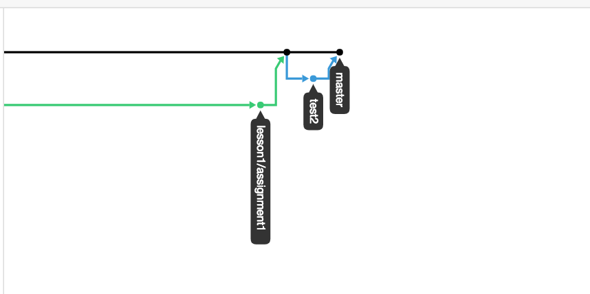
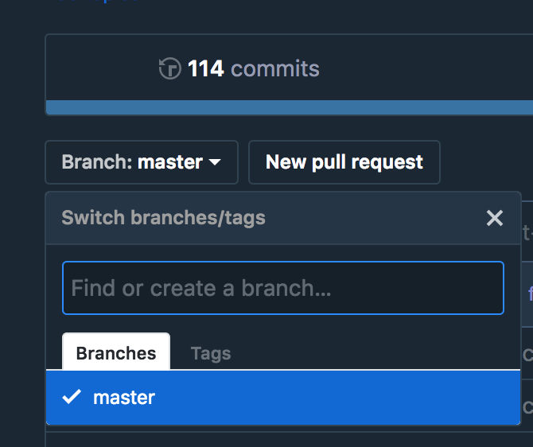
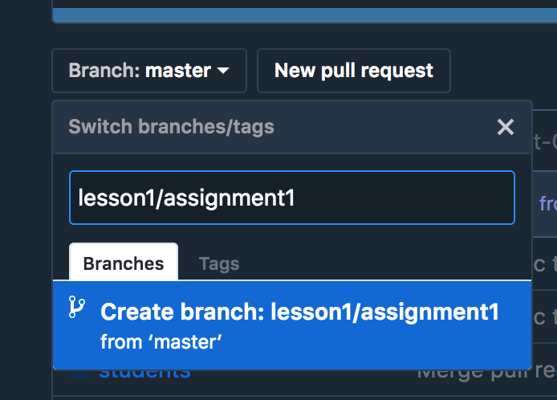
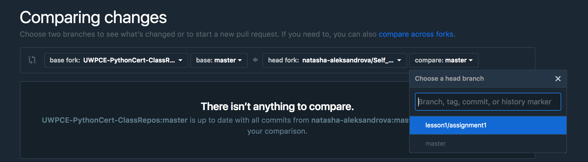
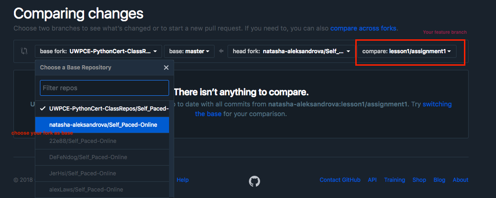

*******************
Feature Branching
*******************

Why use Feature Branches?
=========================

The idea is to give a clear, highly focused purpose to each branch,
which is why we call them feature branches. They represent specific
feature being added or in our case a single assignment.

When using feature branches you isolate your code from everything else,
and Pull Request becomes easier to review as they only contain one
thing. This also mean that you can work on multiple features (multiple
assignments) at the same time without effecting each other and being
able to have two separate clean PRs along side.

Keep in mind that in a more professional setting the "master" branch
represents production code and will be the cleanest most stable branch.

Below is what's called "Network Graph" of git activity. This displays
best what happens with feature branches.

The black line represents master, the green represents my 1st feature
branch that got merged into master (you can see arrow goes to black
line), then I created second feature branch called "test2" (blue line)
and that also got merged into master.

So feature branches get branched off the main branch (master) at some
point in time, then you do some isolated work, then merge it back into
main branch. No commits to master will affect your work in your feature
branch while you're in it.

Workflow
========

**1. Feature / Assignment Branch**
----------------------------------

Below explains the process for creating your feature branch. You can
either use command line or the UI.

Creating feature branch via Command Line
~~~~~~~~~~~~~~~~~~~~~~~~~~~~~~~~~~~~~~~~

First make sure you're on master and make sure you have the latest
changes

      .. code-block::  
      
         git checkout master
      
         git pull
        
next you will create a new branch (-b flag) based of master

      .. code-block::

         git checkout -b <new_feature_branch_name>

Here is the full example:

      .. code-block:;

         $ git checkout master

         Already on 'master'

         Your branch is up to date with 'origin/master'.

         $ git pull

         $

         $ git checkout -b lesson1/assignment1

         Switched to a new branch 'lesson1/assignment1'

         $ git branch

         feature_branch

         \* lesson1/assignment1 <------- { \* } asterisk here indicates your current branch

         master

That's it. You are now on an isolated feature branch, do your work and
make commits to this branch. There should be no difference.. when you're
ready to push your changes you would now push to your feature branch
instead of master:

      .. code-block::
         git push origin <new_feature_branch_name>

Creating feature branch via github UI
~~~~~~~~~~~~~~~~~~~~~~~~~~~~~~~~~~~~~

Navigate to your forked github repo and identify Branch dropdown:

Initially you should only see master branch listed. Within that dropdown
type the name of the new feature branch, for this example we will call
it lesson1/assignment1

Once you start typing the name of the branch, and if it does not
currently exist, you will get a prompt to create new branch. Click into
highlighted area (colors may differ based on browser or theme) and now
you have a new branch!

Go into command line and check out this new branch:

      .. code-block::
      
         $ git pull

         $ git checkout lesson1/assignment1

         Switched to branch 'lesson1/assignment1'

         $ git branch

         feature_branch

         \* lesson1/assignment1 <------- { \* } asterisk here indicates your current branch

         master

         $

**2. When Feature Work is Complete**
------------------------------------

When you're done working on your feature branch it is time to create a
Pull Request to get your changes into master branch (both main class
repo and fork)

Create PR into main repo
~~~~~~~~~~~~~~~~~~~~~~~~

In github UI navigate to Pull Requests and select New pull request
button, you should now see options for source/target and branches

In the far right dropdown you will want to select your feature branch.
Create the PR.

Merge your feature branch into \ **your forked ** master branch
~~~~~~~~~~~~~~~~~~~~~~~~~~~~~~~~~~~~~~~~~~~~~~~~~~~~~~~~~~~~~~~

command line
^^^^^^^^^^^^

note that you can always verify you are in your forked version by
running below command which should show URL of origin

      .. code-block::

            git remote show origin

now check out master and make sure it is up to date

      .. code-block::

            git checkout master

            git pull

next merge your feature branch (in our example lesson1/assignment1
into master

      .. code-block::

            git merge --no-ff lesson1/assignment1

next you will be prompted to commit with pre-populated commit message,
then save and close.

finish up with

      .. code-block::

            git push origin master

github UI
^^^^^^^^^

If you're not comfortable with command line, it is very easy to do in
the github UI!

Navigate to Pull Requests again, and press New Pull request button, you
will now select your fork on the far left with master branch, and your
feature branch on the far right.

Create your pull request, then merge it and delete feature branch.

Extensive Explanation of Feature Branching
==========================================

Highly recommend to read:

https://www.atlassian.com/git/tutorials/comparing-workflows/feature-branch-workflow

https://blog.landscape.io/use-feature-branches-for-everything.html

.. |/C:/0bf0c7c043a7eccd259ad90f33abec53| image:: media/image1.tmp
   :width: 6.5in
   :height: 3.23611in
.. |/C:/04c75be7248dba75f46e74caa1b1475d| image:: media/image2.tmp
   :width: 6.5in
   :height: 5.44444in
.. |/C:/8a2f0b6bbca774cd67feef216634bebb| image:: media/image3.tmp
   :width: 6.5in
   :height: 4.65278in
.. |/C:/149b8431478db0a08549eb2e1a8edf45| image:: media/image4.tmp
   :width: 6.5in
   :height: 1.79167in
.. |/C:/389742fb1b53a8d44e040c5525a1ad05| image:: media/image5.tmp
   :width: 6.5in
   :height: 2.59722in
